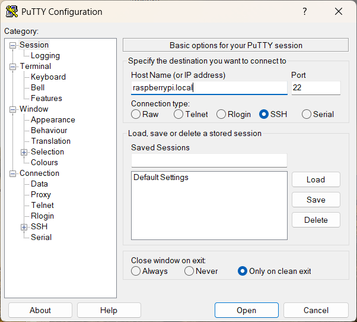
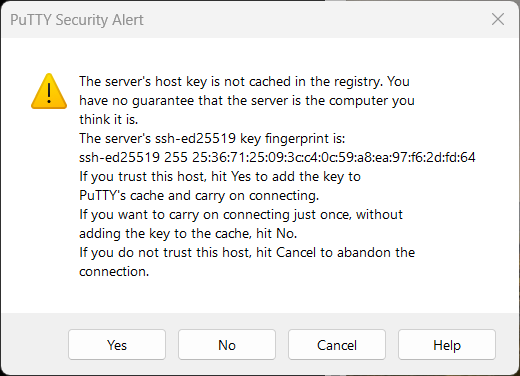
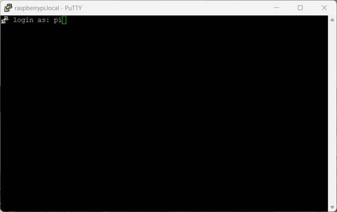
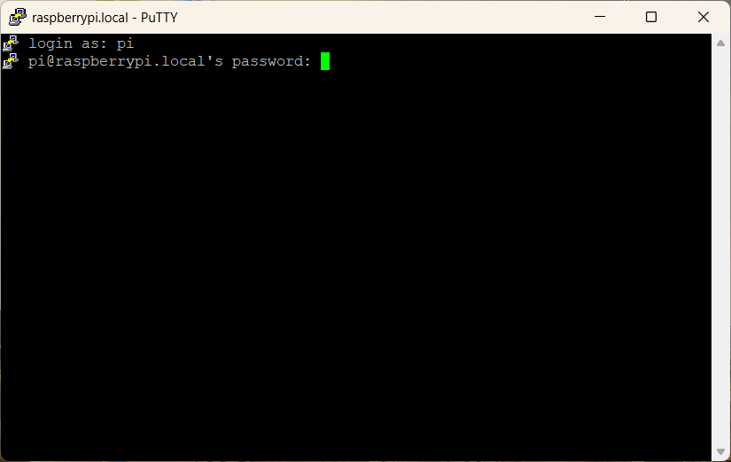
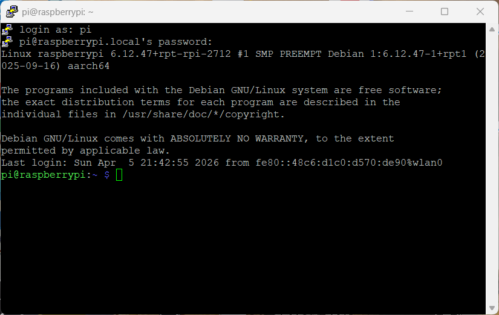
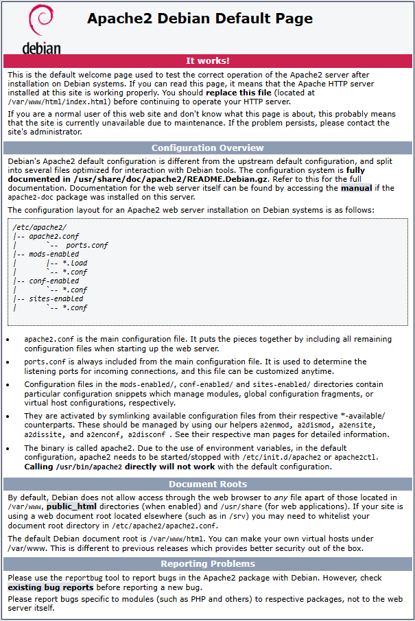
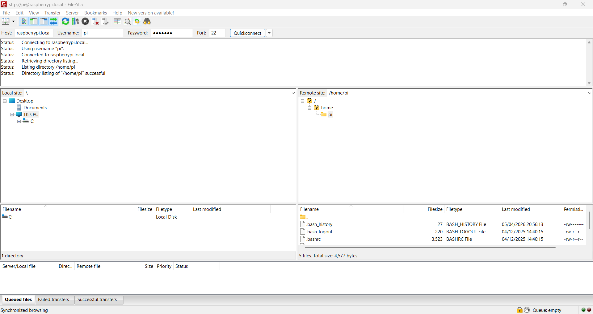

# Installation Guide

This guide describes how to install and configure the software required
to run the **RNA-seq Analysis on Raspberry Pi** system on a **Raspberry Pi 5**
using **Raspberry Pi OS 64-bit Lite (headless)**.

The system uses:

-   Raspberry Pi OS Lite
-   Apache2 web server
-   JupyterLab
-   external USB SSD storage
-   bioinformatics tools for RNA-seq analysis

------------------------------------------------------------------------

# Hardware Platform

Tested configuration:

| Component | Specification |
|---|---|
| Single board computer | Raspberry Pi 5 |
| Operating system | Raspberry Pi OS Lite (64-bit) |
| System storage | microSD card (32 GB) |
| Data storage | External USB SSD (e.g. 1 TB) |
| Network | Ethernet or WiFi |

------------------------------------------------------------------------

# Install Raspberry Pi OS (Headless)

Download the latest version of **Raspberry Pi Imager** from:

https://www.raspberrypi.com/software/

Insert your microSD card and select:

**Raspberry Pi OS (Other) → Raspberry Pi OS Lite (64-bit)**

This version has **no desktop environment**, which reduces system
overhead and improves stability for server-based applications.

------------------------------------------------------------------------

# Configure Customisations

Before flashing the OS, apply OS customisation settings in Raspberry Pi Imager.

-   Set hostname e.g.: `raspberrypi`
-   Set username and password
-   Configure WiFi if required
-   Enable SSH (**Use password authentication** for first setup)
-   Do not enable Raspberry Pi Connect unless specifically required

Write the SD card and, when complete, insert it into the Raspberry Pi.

For simplicity, on first boot of a fresh installation, connect a monitor,
keyboard and mouse to the Raspberry Pi.

Boot the Raspberry Pi.

Login to the Raspberry Pi.

In future you can remove the monitor, keyboard and mouse and instead
connect via SSH using terminal apps such as PuTTY, Windows Terminal etc...

PuTTY: https://putty.org/index.html

Example from PuTTY Terminal using the hostname you previously set:

<p align="left">
  <br>
  Click 'Open'
</p>

<p align="left">
  <br>
  Click 'Yes'
</p>

<p align="left">
  <br>
  Input the username e.g. 'pi'
</p>

<p align="left">
  <br>
  Input password
</p>

<p align="left">
  <br>
  Login success!
</p>

------------------------------------------------------------------------

# Update the System

Once connected via SSH, update the OS:
```
sudo apt update
sudo apt upgrade -y
```

# Install Apache2 Web Server

Install Apache2:
```
sudo apt install apache2 -y
```
Verify the service is running:
```
sudo systemctl status apache2
```
Among the text you should see something similar to:
```
Active: active (running)
```
------------------------------------------------------------------------

# Test the Web Server

If you set your hostname to raspberrypi previously, then open a browser
on your local network and navigate to:
```
http://raspberrypi.local
```
Otherwise replace raspberrypi above with the hostname you chose.

Or alternatively if you know the IP address of your Raspberry Pi, for example:
```
http://192.168.1.50
```
You should see the default Apache page:
```
Apache2 Debian Default Page
```
<p align="left">
  
  <br>
  Web Server success!
</p>
------------------------------------------------------------------------

# Install FileZilla

Install FileZilla on your Laptop/PC for easy file transfer to your Raspberry Pi

Download the latest version of **FileZilla** from:

https://filezilla-project.org/

------------------------------------------------------------------------

# Web Root Directory

The default web root is:
```
/var/www/html
```

Example file:
```
/var/www/html/index.html
```
'Apache2 Debian Default Page' is the file at /var/www/html/index.html

When you open http://raspberrypi.local in a browser, you are opening the file /var/www/html/index.html

This index.html page is visible to all PCs connected to the local area network via a web browser, by going to the address http://raspberrypi.local

------------------------------------------------------------------------

# View Web Root Directory in FileZilla

Open FileZilla Software

Connect to the Raspberry Pi:
```
Host: raspberrypi.local
Username: pi
Password: your passowrd
Port: 22
```
Click on: Quickconnect

<p align="left">
  
</p>

FileZilla above shows the Raspberry Pi root directory in the right hand side pane i.e. "Remote site"

To view the /var/www/html folder, click on the folder icon next to / at the top of the folder tree

Scroll down to the bottom of the tree, to the base folder named 'var' and double click to open it

Then www, then html and you should see the index.html file i.e. 'Apache2 Debian Default Page'

------------------------------------------------------------------------

# Create a web-accessible directory to mount the USB SSD

Folder structure is /var/www/html/usb

Create the directory:
```
sudo mkdir -p /var/www/html/usb
```
Set permissions:
```
sudo chown -R pi:www-data /var/www/html
sudo chmod -R 775 /var/www/html
```
Click the refresh button in FileZilla to view this new usb folder

------------------------------------------------------------------------

# Install Core Software

Install required packages:
```
sudo apt install python3 python3-pip python3-venv git default-jre fastqc wget unzip -y
```
------------------------------------------------------------------------

# Install SRA Toolkit (APT)

Install via package manager:
```
sudo apt install sra-toolkit -y
```
<p align="left">
  
  Click Enter
</p>

Verify installation:
```
prefetch --version
fasterq-dump --version
```
------------------------------------------------------------------------

# Install Kallisto (APT)
```
sudo apt install kallisto -y
```
Verify: 
```
kallisto version
```
------------------------------------------------------------------------

# Install JupyterLab

Install using pip:
```
pip3 install jupyterlab
```
Verify:
```
jupyter lab --version
```
------------------------------------------------------------------------

JupyterLab Working Directory

Use the USB SSD as the working directory:
```
/var/www/html/usb
```
This ensures:

- large FASTQ files are not stored on the SD card
- improved I/O performance
- reduced SD card wear
  
------------------------------------------------------------------------
