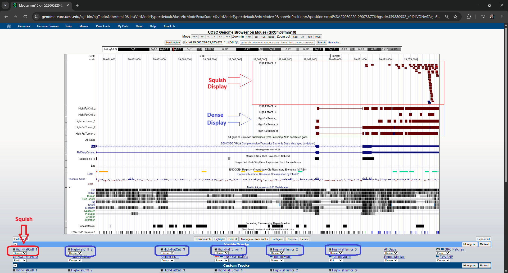

# FastQC Reports

To view the FastQC reports, go to either the fastqc-untrimmed-results or fastqc-trimmed-results folders and click on the appropriate hyper-link to open the rendered .html results file.

# Below screenshot of the resulting BAM files displayed in genome browser website

For detailed instructions see Jupyter file: 5_visualize_bam_file_alignment_at_the_leptin_gene_locus.ipynb

Note: For visual benefit, only the 'High-FatCrtl_1' sample data is set to display as 'Squish', all other samples are displayed as 'Dense', see the dropdown menus in screenshot below for reference.

Website: https://genome-euro.ucsc.edu/cgi-bin/hgGateway

   

